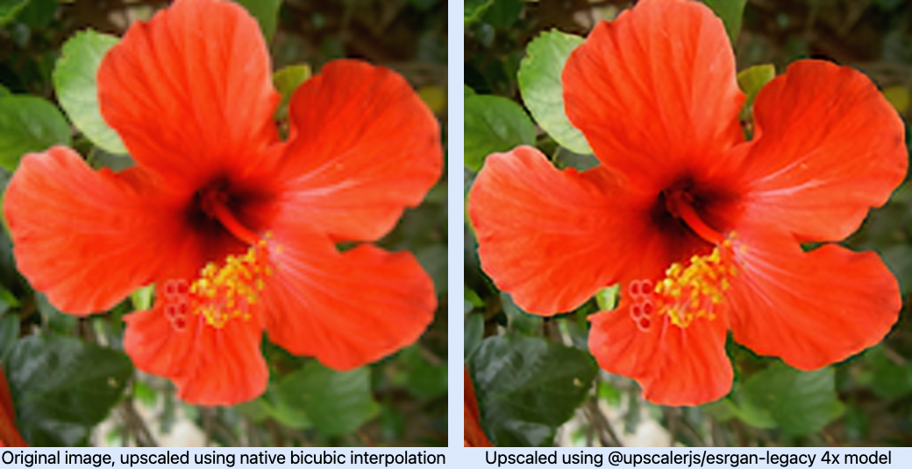

# UpscalerJS

<a href="https://github.com/thekevinscott/UpscalerJS/blob/master/LICENSE"></a>
<a href="https://www.npmjs.com/package/upscaler"></a>
<a href="https://github.com/thekevinscott/UpscalerJS/actions/workflows/tests.yml"></a>
<a href="https://codecov.io/gh/thekevinscott/upscalerjs"></a>
<a href="https://deepsource.io/gh/thekevinscott/UpscalerJS/?ref=repository-badge"></a>


UpscalerJS is a tool for enhancing images in Javascript using Neural Networks. UpscalerJS features models enabling the following:

- Super Resolution
- Deblurring
- Denoising
- Deraining
- Dehazing
- Low Light Enhancement
- Retouching
- Inpainting (soon!)



[A live demo is here](https://upscalerjs.com/demo).

## Announcement

[A beta version of `1.0.0`](http://npmjs.com/package/upscaler) was released on 7/15/22. [Learn more here](https://twitter.com/upscalerjs/status/1547662175950344192) about what's included.

If you are migrating from `<=0.12`, and you are using a custom model, [you will need to modify how you load models](https://upscalerjs.com/#/?id=instantiation). If you are using the default model (e.g., not providing a `model` argument) then no changes are needed.


## Guides

You can [view runnable code examples](https://upscalerjs.com/documentation/guides/). You can also find the [guides here on Github](https://github.com/thekevinscott/UpscalerJS/tree/main/examples).


## Quick Start

```javascript
import Upscaler from 'upscaler';
const upscaler = new Upscaler();
upscaler.upscale('/path/to/image').then(upscaledImage => {
  console.log(upscaledImage); // base64 representation of image src
});
```

## Documentation

[View the docs here.](https://upscalerjs.com)

## Developing

If cloning the repo, [ensure that `dvc` is installed](http://dvc.orgv). `dvc` is used to manage the model files and has git pre-hooks enabled.

## License

[MIT License](https://oss.ninja/mit/developit/) © [Kevin Scott](https://thekevinscott.com)

