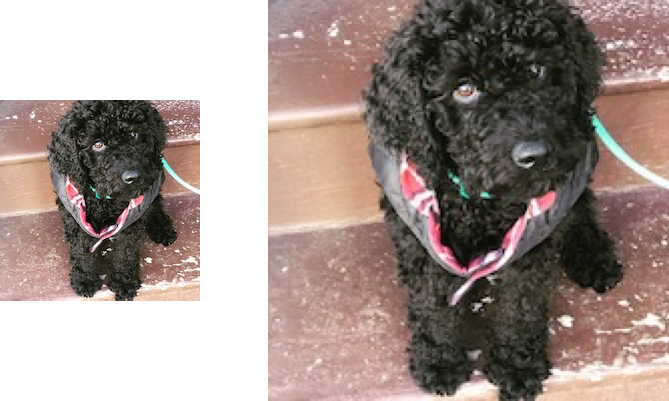
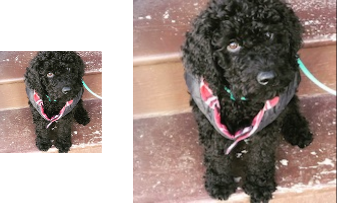
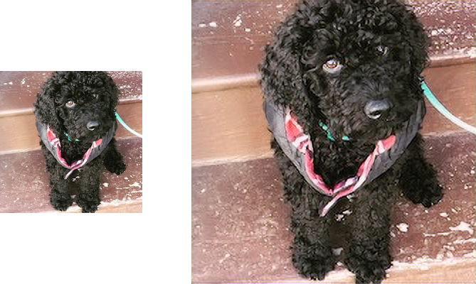

# UpscalerJS

<a href="https://travis-ci.org/github/thekevinscott/UpscalerJS"></a>
<a href="https://codecov.io/gh/thekevinscott/upscalerjs"></a>
<a href="https://www.npmjs.com/package/upscaler"></a>
<a href="https://github.com/thekevinscott/UpscalerJS/issues"></a>
<a href="https://github.com/thekevinscott/UpscalerJS/blob/master/LICENSE"></a>

UpscalerJS is a tool for increasing image resolution in Javascript via a Neural Network up to 4x.


[A live demo is here](https://upscaler.ai).

**Features**

* 📷 Scale images at 2x, 3x, and 4x resolutions.
* 🚀 Browser & Node Support
* 📦 ️Simple modern ES6 interface
* 🤖 Choose from a variety of pre-trained models, or provide your own
* ⚛️ Integration with React
* 🛡️ Rigorously tested with close to 100% code coverage

## Motivation

### Why?

Increasing an image's size results in a pixelated image:



Most browsers by default use an algorithm called bicubic interpolation to get a more pleasing version, but this loses image quality and increases blurriness:



Neural Networks [can allow us to "paint in" the expanded sections of the image](https://paperswithcode.com/task/image-super-resolution), enhancing quality.



### Benefits of the Browser

Why do this in the browser?

Most cutting edge Neural Networks demand heavy computation and big GPUs, but UpscalerJS leverages Tensorflow.js to run directly in your browser. Users' data can stay on their machines, and you don't need to set up a server.

## Getting Started

### Quick Start

```javascript
import Upscaler from 'upscaler';
const upscaler = new Upscaler();
upscaler.upscale('/path/to/image').then(upscaledImage => {
  console.log(upscaledImage); // base64 representation of image src
});
```

In Node, make sure you've installed the appropriate Tensorflow.js package, and import the Node-specific Upscaler package.

If using `@tensorflow/tfjs-node`:

```javascript
import Upscaler from 'upscaler/node';
const upscaler = new Upscaler();
upscaler.upscale('/path/to/image').then(upscaledImage => {
  console.log(upscaledImage); // base64 representation of image src
});
```

If using `@tensorflow/tfjs-node-gpu`:

```javascript
import Upscaler from 'upscaler/node-gpu';
const upscaler = new Upscaler();
upscaler.upscale('/path/to/image').then(upscaledImage => {
  console.log(upscaledImage); // base64 representation of image src
});
```
### Install

Yarn:

```
yarn add upscaler
```

NPM:

```
npm install upscaler
```

### Dependencies

If running in the browser, UpscalerJS expects `@tensorflow/tfjs` to be available as a peer dependency.

If running in Node, UpscalerJS expects either `@tensorflow/tfjs-node` or `@tensorflow/tfjs-node-gpu` to be available as a peer dependency, depending on whether you import `upscaler/node` or `upscaler/node-gpu`.

### Examples 

You can [view runnable code examples](https://github.com/thekevinscott/UpscalerJS/tree/master/examples) on CodeSandbox.

## Usage

### Instantiation

When instantiating UpscalerJS, you must provide a model, which determines the image scaling factor.

UpscalerJS provides a number of pretrained models out of the box. UpscalerJS will automatically choose one, or you can pick a pretrained one:

```javascript
const upscaler = new Upscaler({
  model: 'div2k-2x',
});
```

Alternatively, you can provide a path to a pre-trained model of your own:

```javascript
const upscaler = new Upscaler({
  model: '/path/to/model',
  scale: 2,
});
```

When providing your own model, **you must provide an explicit scale**. Conversely, if you are requesting a pretrained model, **do not** provide an explicit scale.

[A full list of pretrained models is available in the models repo](https://github.com/thekevinscott/UpscalerJS-models).

### Upscaling

You can upscale an image with the following code:

```javascript
upscaler.upscale('/path/to/image').then(img => {
  console.log(img);
});
```

In the browser, you can provide the image in any of the following formats:

* `string` - A URL to an image. Ensure the image can be loaded (for example, make sure the site's CORS policy allows for loading).
* `tf.Tensor3D` or `tf.Tensor4D` - A tensor representing an image.
* [Any valid input to `tf.browser.fromPixels`](https://js.tensorflow.org/api/latest/#browser.fromPixels)

In Node, you can provide the image in any of the following formats:

* `string` - A path to a local image, _or_ if provided a string that begins with `http`, a URL to a remote image.
* `tf.Tensor3D` or `tf.Tensor4D` - A tensor representing an image.
* `Uint8Array` - a `Uint8Array` representing an image.
* `Buffer` - a `Buffer` representing an image.

By default, a base64-encoded `src` attribute is returned. You can change the output type like so:

```javascript
upscaler.upscale('/path/to/image', {
  output: 'tensor',
}).then(img => {
  console.log(img);
});
```

The available types for output are:

* `src` - A src URL of the upscaled image.
* `tf.Tensor3D` - The raw tensor.

#### Performance

For larger images, attempting to run inference can impact UI performance. To address this, you can provide a `patchSize` parameter to infer the image in "patches" and avoid blocking the UI. You will likely also want to provide a `padding` parameter:

```
```javascript
  patchSize: 64,
  padding: 5,
})
```

Without padding, images will usually end up with unsightly artifacting at the seams between patches. You should use as small a padding value as you can get away with (usually anything above 3 will avoid artifacting).

Smaller patch sizes will block the UI less, but also increase overall inference time for a given image.

### Pretrained Models

There are a number of pretrained models provided with the package:

| Key | Dataset | Scale | Example |
| --- | --- | --- | --- |
| `2x` | div2k | 2 | [View](https://github.com/thekevinscott/UpscalerJS-models/tree/master/examples/div2k#2x) |
| `3x` | div2k | 3 | [View](https://github.com/thekevinscott/UpscalerJS-models/tree/master/examples/div2k#3x) |
| `4x` | div2k | 4 | [View](https://github.com/thekevinscott/UpscalerJS-models/tree/master/examples/div2k#4x) |

You can read more about the pretrained models at the dedicated repo [UpscalerJS-models](https://github.com/thekevinscott/UpscalerJS-models).

## API

### `constructor`

Instantiates an instance of UpscalerJS.

#### Example

```javascript
const upscaler = new Upscaler({
  model: 'div2k-2x',
  scale: 2,
  warmupSizes: [[256, 256]]
});
```

#### Options

* `model` (`string`) - A string of a pretrained model, or a URL to load a custom pretrained model.
* `scale` (`number`) - The scale of the custom pretrained model. Required if providing a custom model. If a pretrained model is specified, providing `scale` will throw an error.
* `warmupSizes` (Optional, `Array<[number, number] | { patchSize: number, padding?: number }`>) - An array of sizes to "warm up" the model. By default, the first inference run will be slower than the rest. This passes a dummy tensor through the model to warm it up. It must match your image size exactly. Sizes are specified as `[width, height]`.

Possible model values are:

* `div2k-2x` - Scale of 2x
* `div2k-3x` - Scale of 3x
* `div2k-4x` - Scale of 4x
* `psnr` - Scale of 2x

### `upscale`

Accepts an image and returns a promise resolving to the upscaled version of the image.

#### Example

```javascript
upscaler.upscale('/path/to/image', {
  output: 'tensor',
  patchSize: 64,
  padding: 5,
  progress: (amount) => {
    console.log(`Progress: ${amount}%`);
  }
}).then(upscaledImage => {
  ...
});
```

#### Options

* `src` (`str|HTMLImage|tf.Tensor3D`) - Path to the image, or an `HTMLImage` representation of the image, or a 3-dimensional tensor representation of the image.
* `options`
  * `output` (`src|tensor`) - The desired output of the function. Defaults to a base 64 `src` representation.
  * `patchSize` (`number`) - The desired patch size to use for inference.
  * `padding` (`number`) - Extra padding to be applied to the patch size during inference.
  * `progress` (`(amount: number, slice?: src|tensor) => void`) - A progress callback denoting the percentage complete.
  * `progressOutput` (`src|tensor`) - An optional value that sets the return type of the second argument of progress
  * `signal` (`AbortSignal`) - An optional signal that allows cancellation of an in-flight upscale request

The `progress` callback optionally returns a second argument with the processed slice of the image:

```javascript
upscaler.upscale('/path/to/image', {
  output: 'tensor',
  progress: (amount, slice) => {
    // do something with the sliced image
  }
});
```

The `slice` format will be a base64 string or a tensor corresponding to the value of `output`. This can be overridden by providing an additional property, `progressOutput`, of the form `src | tensor` that will override the value set in `output`.

You can cancel an `upscale` request by providing an `AbortSignal`:

javascript```
const abortController = new AbortController();
upscaler.upscale('/path/to/image', {
  signal: abortController.signal,
}).catch(err => {
  // I have been cancelled.
});
... some time later
abortController.abort();
```

It's worth noting that calls to `model.predict()` in Tensorflow.js cannot be aborted; if you wish to enable the ability to cancel an inflight request, specifying patch sizes will periodically allow the `upscale` request to release and potentially abort.

### `warmup`

If desired, the model can be "warmed up" after instantiation by calling `warmup` directly.

#### Example

```javascript
upscaler.warmup([[256, 256]]).then(() => {
  // all done.
});
```

Or you can provide a patch size and padding:

```javascript
upscaler.warmup([{
  patchSize: 64,
  padding: 5,
}]).then(() => {
  // all done.
});
```

#### Options

* `warmupSizes` (Optional, `Array<[number, number]`>) - An array of sizes to "warm up" the model.

### `getModel`

Gets the underlying model.

#### Example

```javascript
upscaler.getModel().then(model => {
})
```

### `dispose`

Disposes the current model. Must be called to free up memory when the Upscaler is no longer needed.

#### Example

```javascript
await upscaler.dispose();
```

## Troubleshooting

### You must provide an explicit scale

When initializing UpscalerJS with a custom model, you need to also denote the numeric scale of the model (2x, 3x, 4x). UpscalerJS needs to know the scale in order to patch correctly.

Scale can be provided at initialization with:

```javascript
const upscaler = new Upscaler({
  model: '/your/custom/model',
  scale: 2,
})
```

### You are requesting the pretrained model but are providing an explicit scale

A pretrained model is trained to upscale to a specific scale. If you initialize UpscalerJS with a pretrained model and also provide an explicit scale, UpscalerJS will throw an error.

You can fix this by not providing a `scale` property if using a pretrained model:

```javascript
const upscaler = new Upscaler({
  model: 'div2k-2x',
})
```

### Padding is undefined

If specifying a patch size but not padding, you will likely encounter artifacting in the upscaled image.


Most of the time, this artifacting is undesired. To resolve the artifacting, add an explicit padding:

```
upscaler.upscale('/path/to/img', {
  patchSize: 64,
  padding: 4,
})
```


If you would like to keep artifacting but hide the warning message, pass an explicit padding value of 0:

```
upscaler.upscale('/path/to/img', {
  patchSize: 64,
  padding: 0,
})
```

### Progress Specified Without Patch Size

If you've specified a `progress` callback but are not specifying `patchSize` in the call to `upscale`, the `progress` callback will never be called. `progress` callbacks only occur when `patchSize` is provided.

In order to have your `progress` callback be called, provide explicit patch sizes:

```
upscaler.upscale('/path/to/img', {
  patchSize: 64,
  progress: ...
})
```
## Contributions 

Contributions are welcome! Please follow the existing conventions, use the linter, add relevant tests, and add relevant documentation.

To contribute pretrained models, head over to [UpscalerJS-models](https://github.com/thekevinscott/UpscalerJS-models).

## Support

* Create a [Github issue](https://github.com/thekevinscott/UpscalerJS/issues) for bug reports, feature requests, or questions
* Follow [@thekevinscott](https://twitter.com/thekevinscott) for announcements
* Add a ⭐️ [star on GitHub](https://github.com/thekevinscott/UpscalerJS) or ❤️ [tweet](https://twitter.com/intent/tweet?url=https%3A%2F%2Fgithub.com%2Fthekevinscott%2Fupscaler&via=thekevinscott&hashtags=javascript,image-enhancement,tensorflow.js,super-resolution) to support the project!

## License

This project is licensed under the MIT License. See the [LICENSE](https://github.com/thekevinscott/UpscalerJS/blob/master/LICENSE) for details.

Copyright (c) Kevin Scott ([@thekevinscott](https://thekevinscott.com))
