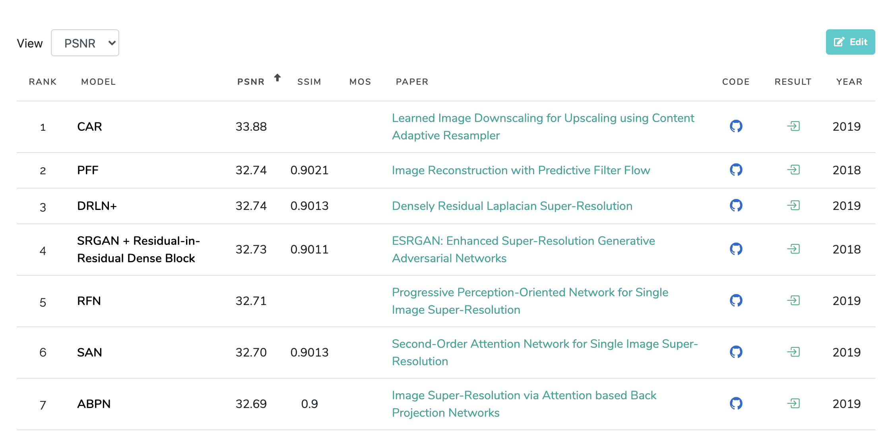
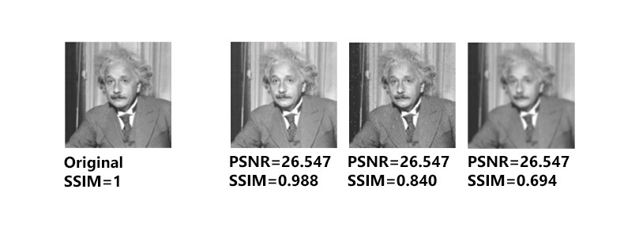
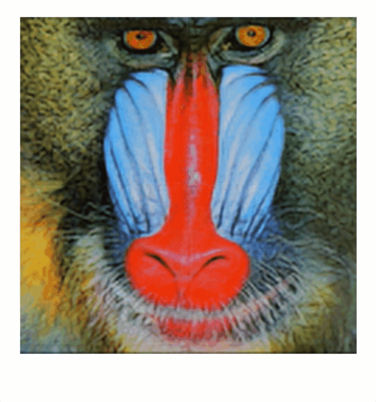
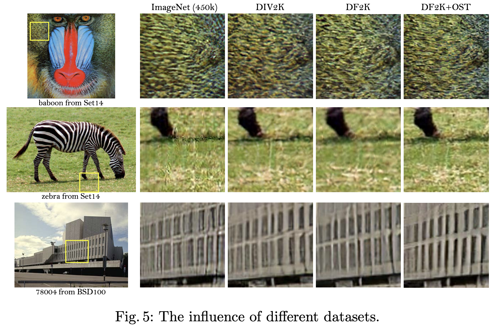

<head>
  <link rel="canonical" href="https://thekevinscott.com/super-resolution-with-js/" />
</head>

I recently released a tool, [UpscalerJS](https://github.com/thekevinscott/UpscalerJS) for doing image upscaling in your browser with Javascript and reducing your image sizes by up to 1/16th. It's designed to be model-agnostic - you can plug and play any trained model that can be converted to Tensorflow.js.

<!--truncate-->

In this article I want to lay out what I consider a killer use case for neural networks in the browser, along with how I went about discovering the research, converting it to Javascript, and ways to improve it in the future.


---

Let's say you're working on an e-commerce platform. Your users upload photos of products to sell.

You've designed a great looking site, built to highlight the beautiful and wondrous products your users have crafted by hand. There's only one problem - once you launch, you find your users are uploading small, pixelated images, and all of a sudden your beautiful site doesn't look quite so beautiful.

(I'm drawing from experience here - this has happened to me more than once.)

You can go back and nag your users for better images - and sometimes this can work. But often, the images they've provided are all they've got. Maybe the images are screenshotted from PDFs, or maybe the images are older and users don't have better ones. And even if they _do_ have better images, it's a labor intensive ask of your users to go back and ask them to fix their images for you, even if it is for their benefit.

Is there a technical solution we can explore? There certainly is and it's called **Super Resolution**.

## What is this "Super Resolution" you speak of?
Let’s say somebody's uploaded a 150px photo to our e-commerce site:


<capt><a href="https://www.flickr.com/photos/30048871@N00/2437627725" target="_blank" rel="noopener noreferrer">A happy dog by merec0</a></capt>

We want to feature that image on our home page because it's a beautiful dog, but our design demands images at 300px. What can we do? If we double each pixel we get a larger image that looks pixelated:

<div style={{textAlign: "center"}}>


</div>
<capt>Image upscaled to 300px.</capt>

You have to [go out of your way to achieve the pixelated look](https://css-tricks.com/keep-pixelated-images-pixelated-as-they-scale/) in the browser; by default most browsers will apply some sort of scaling algorithm to the image, usually [bicubic interpolation](https://en.wikipedia.org/wiki/Bicubic_interpolation), which looks like:

<div style={{ textAlign: "center" }}>


</div>
<capt>Image upscaled to 300px using Bicubic Interpolation.</capt>

An image upscaled using bicubic interpolation certainly looks less pixelated than the first, and I'd wager most folks find it more aesthetically appealing, but it’s blurry, and no one will mistake it for a high resolution image. 

**Super Resolution is a Machine Learning technique for reconstructing a higher resolution image from a lower one.** You can think of the process as painting new pixels into the image, achieving a higher fidelity than is possible with an algorithm like bicubic interpolation.

<div style={{ textAlign: "center" }}>


</div>
<capt>Image upscaled to 300px using a GAN.</capt>

There’s [many different approaches](https://arxiv.org/abs/1902.06068) you can use to implement super resolution and some great blog posts describing the underlying theory are available [here](https://towardsdatascience.com/an-evolution-in-single-image-super-resolution-using-deep-learning-66f0adfb2d6b) and [here](https://medium.com/beyondminds/an-introduction-to-super-resolution-using-deep-learning-f60aff9a499d).

<iframe width="560" height="315" src="https://www.youtube.com/embed/LhF_56SxrGk?start=15" frameborder="0" allow="accelerometer; autoplay; clipboard-write; encrypted-media; gyroscope; picture-in-picture" allowfullscreen></iframe>

Super Resolution [is usually implemented on the backend using Python](https://letsenhance.io/). There's good arguments for building it this way. Running it on the backend gives you access to beefy hardware, and that hardware lets you use the latest, most accurate models. If getting the highest resolution images is important, backend deployments are a good choice. Additionally, many use cases are "scale once, display often" - if it takes a little longer to upscale an image, well, no big deal.

On the other hand, there's drawbacks to implementing this on the backend. One is immediate feedback - you need to upload the image to a server, process it, and send it back down, which can take a while, depending on your user's connection and the size of your model. This can be non-trivial, especially because so many cutting edge implementations are at the bleeding edge, with unstable dependencies and changing requirements. And, if your deployment needs GPUs, that could end being an expensive proposition, and hard to scale.

It turns out that we can run this in the browser, and doing so has some clear benefits.

First, that issue of deployment? Totally gone. Running a neural network in Javascript means nothing to install, no GPUs to provision - Tensorflow.js takes care of all of that. The models run directly in your users' browsers.

Second, your users will see more immediate feedback. Particularly for connections that might have slower bandwidth - like a phone - performing inference directly on the device can cut out a costly round trip step.

Third, and in my mind, the most compelling argument - you can serve smaller images. Sometimes, _much_ smaller images. 

For instance, those images above? The 300px is 724kb. The 150px version? It's _9kb_. 

That's an image that's _6 percent_ of the original file size. That is a massive reduction!

There are, of course, some clear drawbacks to running in the browser. The biggest is that you're constrained by the hardware of your users. And this manifests in two ways. One is, if you want to deploy the latest and greatest models, you may be out of luck. Particularly if they are GPU hungry, they just might not be capable of running in the browser. In recent years, hardware manufacturers including Apple and Google [have invested huge sums of money in improving the performance](https://heartbeat.fritz.ai/hardware-acceleration-for-machine-learning-on-apple-and-android-f3e6ca85bda6) of their on-device chips, with a particular focus on improving the ability to run neural networks on devices. The good news is that, year after year, the performance of this technology will get better; the bad news is that, for users on older devices, the disparity between performance will become that much more significant. If you want a consistent experience across platforms, server-side solutions may be a better bet.

Ultimately, though the precise tradeoffs will depend on the use case, Javascript is absolutely a worthy contender for considering an application of this technology. Let's see how we can evaluate what's out there, and see what would work for our purposes.

## Hearing it through the grapevine

If you come from the world of Javascript, a question on your mind is - how do you even hear about this research in the first place?

Most cutting edge Machine Learning research is posted to [arxiv.org](https://ARXIV.org), where it is freely searchable and downloadable in PDF form. This is academic research, papers that can tend to be theory and math heavy and hard to penetrate. This can scare off a lot of people - it certainly scared me off at first.

I don’t want to minimize the importance of fully understanding the research - deeply understanding theory often can lead to novel insights and development that is relevant to your field - but you don’t necessarily _need_ a deep understanding of the technology to use it. Particularly if you’re focused on inference, like we are in this case, you can rely on others to evaluate the research, as well as implement the training code, and in some cases, provide the trained models.

There's a website that does just this called [Papers With Code](https://paperswithcode.com/):


Research is categorized by subject area, and ranked by its performance against recognizable metrics. [There's even a specific category dedicated to this domain](https://paperswithcode.com/task/image-super-resolution).



You can see the performance of each implementation against a standard dataset, and see how they're measured on different metrics. PSNR and SSIM are two common ways of measuring performance for Super Resolution tasks; [PSNR](https://en.wikipedia.org/wiki/Peak_signal-to-noise_ratio) can measure noise, and [SSIM](https://en.wikipedia.org/wiki/Structural_similarity) measures the similarity between two images. 


<capt><a href="https://medium.com/@datamonsters/a-quick-overview-of-methods-to-measure-the-similarity-between-images-f907166694ee" target="_blank" rel="noopener noreferrer">From "A Quick Overview of Methods to Measure the Similarity Between Images"</a></capt>

Metrics can be a bit tricky. You can see in the above image that identical PSNR scores can have radically different SSIM scores, with correlatingly different visual performance.

Both PSNR and SSIM are measurements of how different an image is from one another, but neither is a replacement for human evaluation. As humans, we perceive images differently than a computer does. A set of pixels that are, say, saturated differently while also being sharper, may lead to a lower metric score, but a more aesthetically pleasing score from a human.

> SR algorithms are typically evaluated by several widely used distortion measures, e.g., PSNR and SSIM. However, these metrics fundamentally disagree with the subjective evaluation of human observers. Non-reference measures are used for perceptual quality evaluation, including Ma’s score and NIQE, both of which are used to calculate the perceptual index in the PIRM-SR Challenge. In a recent study, Blau et al. find that the distortion and perceptual quality are at odds with each other. &mdash; [Wang et al.](https://arxiv.org/pdf/1809.00219v2.pdf)

In addition to the subjectivity involved in judging a model's accuracy, there's other reasons that accuracy is not the paramount concern for us. Remember, our final goal is a model that runs in Javascript. It's also important to consider:

* __A good paper__. We want an architecture that is sound. We’ll probably need to develop some familiarity with the underlying theory, so it’s important that a paper be clear and digestible, as well as rigorous; how often a paper’s been cited can also be a good indicator of its overall quality.
* __Good performance__. Speed is as important as accuracy. A model that takes a minute to run is not going to be suitable for the browser.
* __Saveable, and convertable__. The implementation’s models must be compatible with Javascript. We'll touch on the specifics shortly, but the big one is to insist on a Tensorflow implementation, as Tensorflow.js is the main way to do Machine Learning in the browser, so Pytorch implementations are out.

I ended up choosing [ESRGAN](https://paperswithcode.com/paper/esrgan-enhanced-super-resolution-generative). 

[I started by looking at papers ranked by their score](https://paperswithcode.com/sota/image-super-resolution-on-set5-4x-upscaling). A few implementations that scored well either had zero linked code implementations, or the code implementations were exclusively in Pytorch. (Not all code implementations will be shown on paperswithcode.com, so it's a good idea to do some Googling of your own.)

ESRGAN ranked highly on the metrics, and boasted more than a few implementations in Tensorflow. The paper itself was reasonably clear and approachable. ESRGAN is based on a prior architecture, [SRGAN](https://arxiv.org/pdf/1609.04802.pdf), which itself is a robust architecture, but ESRGAN makes a number of improvements, including an improved building block for the generator, an improved discriminator for predicting how realistic an image appears, and a more effective perceptual loss.

Of the implementations I could find, I felt three satisfied my criteria, seeming of decent code quality and with good documentation.

* [idealo/image-super-resolution](https://github.com/idealo/image-super-resolution)
* [krasserm/super-resolution](https://github.com/krasserm/super-resolution)
* [peteryuX/esrgan-tf2](https://github.com/peteryuX/esrgan-tf2)

It’s difficult to ascertain whether an implementation will be a good fit without downloading the code and running it. If you’re used to installing an `npm` library and jumping right in, prepare yourself: working with Machine Learning code can often be an exercise in frustration. Working through dependency challenges, environmental issues, and memory bottlenecks can turn an evaluation into a multi-day affair. 

For that reason, repos that include `Dockerfile`s or Google Colab links are generally a very good sign. It’s also a good sign when the author includes pretrained weights, along with documentation on how those weights were trained. If you’re able to skip right to inference, it helps assess a model much faster; likewise, information on how those weights were trained gives you the ability to test your own implementation, which gives you a solid benchmark. Neglecting to include these in a repo is not a dealbreaker, but it will make your life harder.

I usually make a point of setting up my _own_ Dockerfile, regardless of whether the author provides one, because as I explore a repo I'll install my own dependencies and write exploratory code that I'll want to be able to run in a reproducible way. In almost every case where I play with some machine learning code only to leave it alone for a few weeks, upon return I’m greeted with some esoteric error caused by some package being out of date or upgraded along the way. Pin your versions, and get a reproducible environment from the start!

I ultimately settled on the implementation by [idealo](https://github.com/idealo/image-super-resolution). The code is easy to read, pretrained models are provided, and the author [provides a wonderful write up of their journey exploring the space](https://medium.com/idealo-tech-blog/a-deep-learning-based-magnifying-glass-dae1f565c359). However, the real clincher was that I could convert the RDN models to Javascript with only a few modifications. Converting the RRDN models was a bit trickier - more on that in a bit.

## Conversion to Javascript
Tensorflow.js provides a handy command line tool for converting models to Javascript called TFJS converter. You can convert a model with something like:

```
tensorflowjs_converter --input_format=keras --output_format=tfjs_layers_model ./rdn-model.h5 rdn-tfjs
```

[I've put together a Google colab that demonstrates this.](https://colab.research.google.com/drive/1WmTHfcNiEWVta5B5AJ5V0dnrQg-JXH06#scrollTo=oMMODAFu05Rc)

To convert a model cleanly to Javascript, there's some things to be aware of:

1. The model must be saved in Keras, or another format compatible with the Tensorflow converter. Also, ensure that you are converting the _model_ into Javascript, and not just the weights. If the latter, you'll probably receive a cryptic error with little guidance as to what's going on.
2. Variables must not refer to `self` - this tripped me up with idealo's implementation. ([Refer to this Github issue](https://github.com/idealo/image-super-resolution/issues/114#issuecomment-605067405), [or my PR](https://github.com/idealo/image-super-resolution/pull/137), for a solution)
3. All of the tensor ops must be implemented in Javascript. I don’t know of a good way of inspecting this other than trial and error (aka, converting the model and seeing if it runs).
4. If custom layers are implemented, those will have to be re-implemented in Javascript. For instance, [the RRDN model's custom layers had to be re-implemented in order to save cleanly](https://github.com/idealo/image-super-resolution/pull/137/files#diff-33e903d44b1c48dec8eabcca53955976R191). Later in this article I'll discuss how to deal with custom layers.
5. In the output of the Tensorflow.js Converter, I had to manually change the model's `class_name` from `Functional` to `Model`. ([In the Google Colab, this is the cell that implements this](https://colab.research.google.com/drive/1WmTHfcNiEWVta5B5AJ5V0dnrQg-JXH06#scrollTo=oMMODAFu05Rc&line=4&uniqifier=1).) I don't know why this is the case, or whether it's a bug or not - comments are welcome!
6. Any pre- and post- processing of images needs to be reproduced in Javascript.

## Pull your weight, fine neurons

Performance is key for browser-based applications. Skinnier models perform better. 

There's two ways we can improve performance in Javascript.

First, we can **quantize** our model. [Quantizing a model means reducing the precision of the model's weights](https://github.com/tensorflow/tfjs-examples/tree/master/quantization). This can potentially lead to lower accuracy, but can reduce model size significantly (and has the side benefit of making the model more compressible over gzip).

We can quantize directly in the tensorflow js converter:

```
tensorflowjs_converter \
   --input_format tfjs_layers_model \
   --output_format tfjs_layers_model \
   --quantize_uint8 \
   original_model/model.json
   quantized_model/
```

In this specific case, the maximum amount of quantization - `uint8` - had no significant effects on the final model's performance.

Second, we can __prune__ our model. Pruning is a process whereby we cull under-performing weights during training. I haven't personally explored this avenue, but if you're interested [you can read more about it here](https://www.tensorflow.org/model_optimization/guide/pruning). It certainly seems like a promising strategy for squeezing out additional performance on the front end.

## Inference in the Browser - show me the code!
We’ve got our RDN model converted and quantized. Success! Now, how do we make it run in the browser? We can load our model with the following:

```javascript
import * as tf from "@tensorflow/tfjs";
tf.loadLayersModel("./rdn-tfjs/model.json");
```

Ensure you load the `model.json`, _not_ the `bin` files.

Then, we can get our image as a _tensor_:

```javascript
const img = new Image();
img.crossOrigin = "anonymous";
img.src = "your-image";
img.onload = () => {
  const tensor = tf.browser.fromPixels(img).expandDims(0);
};
```

Tensors are a numeric data structure used in almost all neural nets, and [you can read more about them here](https://thekevinscott.com/tensors-in-javascript/).

Two things to note in the code above: 

1. If you're dealing with images from other domains you may run into CORS issues. Setting `crossOrigin` to `anonymous` can help. 
2. You'll need to call `expandDims` on the tensor you grab from your image. You'll need to pass a four-dimensional tensor to your model; to learn more on why, [you can check out my article on image classification here](https://thekevinscott.com/image-classification-with-javascript/#4-translate-the-tensor).

Now that we have a tensor, we can run it through our model:

```javascript
import tensorAsBase64 from 'tensor-as-base64';
const prediction = model.predict(tensor).squeeze();
```

And viola! You have an upscaled tensor, ready to display in your browser!

[Here's an implementation of all that code on CodeSandbox](
https://codesandbox.io/s/upscaling-1-0xmbx?file=/src/index.js):

<iframe src="https://codesandbox.io/embed/upscaling-1-0xmbx?fontsize=14&hidenavigation=1&theme=dark&view=preview"
     style={{
      width: '100%',
      height: '320px',
      border: 0,
      borderRadius: '4px',
      overflow: 'hidden',
     }}
     title="Upscaling-1"
     allow="accelerometer; ambient-light-sensor; camera; encrypted-media; geolocation; gyroscope; hid; microphone; midi; payment; usb; vr; xr-spatial-tracking"
     sandbox="allow-forms allow-modals allow-popups allow-presentation allow-same-origin allow-scripts"
   ></iframe>

It still takes a while - in my case, around 2.5 seconds - which is unacceptable for production. Also, it has the nasty side effect of freezing the UI while it works. Let’s look at a number of different strategies for improving performance.

### Warm ups

The initial invocation of a neural network in Tensorflow.js will take a long time, but _subsequent_ invocations will be much faster.

> TensorFlow.js executes operations on the GPU by running WebGL shader programs. These shaders are assembled and compiled lazily when the user asks to execute an operation. The compilation of a shader happens on the CPU on the main thread and can be slow. TensorFlow.js will cache the compiled shaders automatically, making the second call to the same operation with input and output tensors of the same shape much faster.
> &mdash; [Tensorflow.js Documentation](https://www.tensorflow.org/js/guide/platform_environment#shader_compilation_texture_uploads)

We can make use of this and "warm up" our model by passing a dummy tensor through. Here’s some code you can use for that ([view the code on CodeSandbox](https://codesandbox.io/s/upscaling-2-warm-up-vjllx?file=/src/index.js)):

```javascript
const dummyTensor = tf.zeros([1, img.height, img.width, 3]);
model.predict(dummyTensor);
```

In this case, inference time drops to 150ms for me. Much better! However, this only works if the tensor sizes match exactly. We obviously can't depend on that - users could upload photos of any size and scale. Also, there's still a noticeable lag on the UI while the model runs its predictions. 

Let's try and tackle the second issue first. What if we move the calculation off the main thread - to a web worker?

### Web Workers
[Here's a CodeSandbox link that demonstrates the use of Web Workers](https://codesandbox.io/s/github/thekevinscott/upscalerjs/tree/master/examples/webworker). (This example uses UpscalerJS instead of writing the TFJS code out by hand, but the concept is the same.)

<iframe src="https://codesandbox.io/embed/github/thekevinscott/upscalerjs/tree/master/examples/webworker?fontsize=14&hidenavigation=1&theme=dark&view=preview"
     style={{
      width: '100%',
      height: '320px',
      border: 0,
      borderRadius: '4px',
      overflow: 'hidden',
      }}
     title="thekevinscott/upscalerjs: webworker"
     allow="accelerometer; ambient-light-sensor; camera; encrypted-media; geolocation; gyroscope; hid; microphone; midi; payment; usb; vr; xr-spatial-tracking"
     sandbox="allow-forms allow-modals allow-popups allow-presentation allow-same-origin allow-scripts"
   ></iframe>

Moving the code to a web worker lets us move the processing off the main thread, which lets us run animations at a much smoother rate. However, it's not a panacea; there's still some choppiness in the animation. I _believe_ this choppiness is coming from the GPU itself locking the thread, which manifests worse on older devices than newer one. Web workers absolutely help, but they don't solve the problem entirely.

### Splitting the image into chunks

What if, instead of processing the full image in one go, we subdivided the image into pieces for processing individually?



If we subdivide our image into sections, we can take one long task and break it into 4 tasks, and after each one we can release the UI thread:

```javascript
const tensor = tf.browser.fromPixels(img);
const [height, width] = tensor.shape;
for (let i = 0; i < 2; i++) {
  for (let j = 0; j < 2; j++) {
    const slicedTensor = tensor.slice(
      [(i * height) / 2, (j * width) / 2],
      [height / 2, width / 2]
    );
    const prediction = model.predict(slicedTensor.expandDims(0)).squeeze();
  }
}
```

[Here's a CodeSandbox link demonstrating this](https://codesandbox.io/s/upscaling-patch-size-demonstration-pdki6?file=/src/index.js).

This significantly improves the responsiveness of our code, but now there's a new problem: 


These upscaled images tend to have artifacting around the edges. This is a fairly common issue inherent in a lot of upscaling algorithms, but it's generally not a problem unless you're closely staring at the edges of your upscaled image. However, in this case - since we're stitching a number of images together into one - the problem is much more apparent.

The fix is to add _padding_ to each of our image slices - something like this:


We can then slice off the extra pixels, and put together an image without any artifacts. [Here's a CodeSandbox that demonstrates that end-to-end](https://codesandbox.io/s/upscaling-3-patch-sizes-8h6pt?file=/src/utils.ts).

The best part is that, so long as you set the patch size small enough - smaller than the smallest image you expect to receive - you'll wind up with consistently sized images. And, remember how in the warm ups section, we mentioned requiring consistently sized images in order to get the benefit of the speed up? This solution does both!

## RRDN and the hunt for Custom Layers
So far, we’ve been dealing with the RDN model. The RRDN model is the more powerful version, and it relies on custom layers, which will need to be reimplemented in Javascript.

I didn't find a ton of documentation out there on custom layers in Tensorflow.js. [There's the official documentation](https://www.tensorflow.org/js/guide/models_and_layers#custom_layers), as well as [this gist by Shanqing Cai](https://gist.github.com/caisq/33ed021e0c7b9d0e728cb1dce399527d), and that's most of what I could find. 

[The two custom layers in Python are defined as](https://github.com/idealo/image-super-resolution/blob/master/ISR/models/rrdn.py#L191):

```python
class PixelShuffle(tf.keras.layers.Layer):
    def __init__(self, scale, *args, **kwargs):
        super(PixelShuffle, self).__init__(*args, **kwargs)
        self.scale = scale

    def call(self, x):
        return tf.nn.depth_to_space(x, block_size=self.scale, data_format='NHWC')

    def get_config(self):
        config = super().get_config().copy()
        config.update({
            'scale': self.scale,
        })
        return config

class MultiplyBeta(tf.keras.layers.Layer):
    def __init__(self, beta, *args, **kwargs):
        super(MultiplyBeta, self).__init__(*args, **kwargs)
        self.beta = beta

    def call(self, x, **kwargs):
        return x * self.beta

    def get_config(self):
        config = super().get_config().copy()
        config.update({
            'beta': self.beta,
        })
        return config
```

In Javascript, those look like:

```javascript
class MultiplyBeta extends tf.layers.Layer {
  beta: number;

  constructor() {
    super({});
    this.beta = BETA;
  }

  call(inputs: Inputs) {
    return tf.mul(getInput(inputs), this.beta);
  }

  static className = 'MultiplyBeta';
}

class PixelShuffle extends tf.layers.Layer {
  scale: number;

  constructor() {
    super({});
    this.scale = SCALE;
  }

  computeOutputShape(inputShape: number[]) {
    return [inputShape[0], inputShape[1], inputShape[2], 3];
  }

  call(inputs: Inputs) {
    return tf.depthToSpace(getInput(inputs), this.scale, 'NHWC');
  }

  static className = 'PixelShuffle';
}
```

You also need to explicitly register each custom layer:

```javascript
tf.serialization.registerClass(MultiplyBeta);
tf.serialization.registerClass(PixelShuffle);
```

Some things to call out here:

* Make sure you define a static `className` on the layer, that matches the name of the layer exactly
* `call` is where you do the bulk of your computation.
* `computeOutputShape` I _believe_ you only need to define if it's different - this function is called to tell TFJS the shape of your output tensor
* You may need to translate function calls from Python to Javascript; for instance `tf.nn.depth_to_space` in Python becomes `tf.depthToSpace` in Javascript

## Training Your Model
One challenge with super resolution techniques is that their scale is fixed.

What that means is that a model trained to scale an image up to 2x, will be unable to go to 3x, or 4x. It will only ever be able to upscale an image to 2x.

To change the scale, you need to train a model from scratch. As you can imagine, to support different scales can drastically increase the amount of training you have to do.

In addition, there’s some sign that further training on specific datasets yields specific benefits related to your domain.

> First we show that larger datasets lead to better performance for PSNR-oriented methods. We use a large model, where 23 Residual-in-Residual Blocks (RRDB) are placed before the upsampling layer followed by two convolution layers for reconstruction ... A widely used training dataset is DIV2K that contains 800 images. We also explore other datasets with more diverse scenes – Flickr2K dataset consisting of 2650 2K high-resolution images collected on the Flickr website. It is observed that the merged dataset with DIV2K and Flickr2K, namely DF2K dataset, increases the PSNR performance.


It's likely that training on a dataset specific to your domain will yield increased accuracy.

Last year I spent some time working with [RAISR](https://ai.googleblog.com/2016/11/enhance-raisr-sharp-images-with-machine.html). One of the key insights in the paper was that compressing the low resolution images led to a more resilient model better able to handle artifacting, while sharpening the high resolution images led to more aesthetically pleasing upscaled images (at the expense of worse performance against the metrics). I suspect - though I don't know for sure - that similar techniques might yield similar benefits in training here, and I'm currently experimenting to find out.

## UpscalerJS

I've packaged this all up into an npm model called [UpscalerJS](https://github.com/thekevinscott/UpscalerJS).

It's agnostic to the upscaling model being used, which means that in the future, I’ll be able to improve models, and potentially introduce models tuned to various use cases (faces, illustrations). I'm currently serving models via JS CDNs and look forward to adding additional models in the future.


I think there's lots of opportunities for improvements, particularly around performance, but I'm frankly thrilled that this is possible. 

Imagine being able to apply this to a video stream. Imagine if you could serve a video at _6%_ of the file size as a normal video stream? We're not there yet - we'd have to get upscaling working 10x faster to handle realtime video - but it's _not far off_. And that's really exciting to think about!
