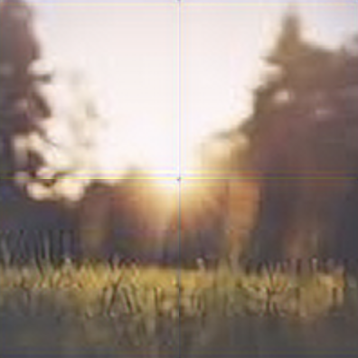

# Troubleshooting

## Padding is undefined

If specifying a patch size but not padding, you will likely encounter artifacting in the upscaled image.



Most of the time, this artifacting is undesired. To resolve the artifacting, add an explicit padding:

```javascript
upscaler.upscale('/path/to/img', {
  patchSize: 64,
  padding: 4,
})
```


If you would like to keep artifacting but hide the warning message, pass an explicit padding value of 0:

```javascript
upscaler.upscale('/path/to/img', {
  patchSize: 64,
  padding: 0,
})
```

## Progress Specified Without Patch Size

If you've specified a `progress` callback but are not specifying `patchSize` in the call to `upscale`, the `progress` callback will never be called. `progress` callbacks only occur when `patchSize` is provided.

In order to have your `progress` callback be called, provide explicit patch sizes:

```javascript
upscaler.upscale('/path/to/img', {
  patchSize: 64,
  progress: ...
})
```

## Unexpected Token

If you're in a Node.js environment, you may encounter something like this:

```
/node_modules/upscaler/dist/browser/esm/index.js:1
export { default, } from './upscaler';
^^^^^^

SyntaxError: Unexpected token 'export'
```

This likely means one of two things:

- You are using `upscaler`, instead of `upscaler/node`; [check out the guide on Node.js here](/documentation/guides/node/nodejs).
- You are using `import` syntax instead of `require` syntax; if so, try switching to `require('upscaler')`. For more information on this, [see this Github issue](https://github.com/thekevinscott/UpscalerJS/issues/554#issuecomment-1344108954).

## Missing Model Path

If you see an error like:

```
Error: You must provide a "path" when providing a model definition
```

You've passed a `null` or `undefined` path argument in the `model` argument to UpscalerJS:

```javascript
const upscaler = new Upscaler({
  model: {
    path: null,
  },
})
```

Ensure you pass a valid `path` argument in the `model` payload. [See the guide on models for more information](/documentation/guides/browser/models).

## Invalid Warmup Value

If you see an error like:

```
Error: Invalid value passed to warmup in warmupSizes: foo
```

It means you've called `.warmup` with an invalid value:

```javascript
upscaler.warmup('foo')
```

Ensure you're passing one of the following:

- `{ patchSize: number; padding: number }`
- `[width, height]`
- `{ patchSize: number; padding: number }[]`
- `[width, height][]`

For more information, [see the guide on warm ups](/documentation/guides/browser/performance/warmup), or review the [API documentation on the `warmup` method](/documentation/api/warmup).

## Environment disallows String Input

If you see an error like:

```
Error: Environment does not support a string URL as an input format.
```

This means that the environment UpscalerJS is running in does not have access to `Image`. This means that it cannot construct an image and load its src.

Examples of such environments include web workers and the like (e.g., Cloudflare workers).

To get around this error, pass your data into UpscalerJS as a tensor. For an example, [check out the guide on web workers](/documentation/guides/browser/performance/webworker).

## Invalid Predicted Tensor

UpscalerJS only supports models that return rank 4 tensors representing image-like data.

You may see this message if you're using a custom model that returns a rank 3 image, or non-image-like data (like text).

If you believe this is in error, or you have a particular use case you think would be appropriate for UpscalerJS, [please open a Github issue](https://github.com/thekevinscott/UpscalerJS/issues/new/choose).

## Environment disallows Base64

If you see an error like:

```
Error: Environment does not support base64 as an output format.
```

This means that the environment UpscalerJS is running in does not have access to `Image` or `document`. This means that it cannot automatically transform a tensor into a base64 representation.

Examples of such environments include web workers and the like (e.g., Cloudflare workers).

To get around this error, specify `tensor` as the `output` format of your data, like:

```javascript
upscaler.upscale(tensor, {
  output: 'tensor',
})
```

_Note: If you've neglected to provide an `output` argument and you're running the browser version of UpscalerJS, you will need to explicitly provide the `output` argument. This is because the default argument is `base64`._

For an example, [check out the guide on web workers](/documentation/guides/browser/performance/webworker).

## Invalid Model Type

Acceptable model types include:

- `layers` (default)
- `graph`

[These correspond to the model types supported by Tensorflow.js](https://js.tensorflow.org/api/latest/#Models-Loading).

If you don't know what kind of model you have, you may be able to inspect your `model.json`. If the JSON file has an entry like below, it's a `layers` model:

```json
{"format": "layers-model", 
```

If it has an entry like below, it's a `graph` model:

```json
{"format": "graph-model", 
```

## Error with Model Input Shape

This error implies that the given model does not have an input layer compatible with a rank 4 tensor. It may be expected a rank 3 tensor, or something else entirely.

UpscalerJS only supports models whose input layers are set up to accept rank 4 tensors.

If you believe this is in error, or you have a particular use case you think would be appropriate for UpscalerJS, [please open a Github issue](https://github.com/thekevinscott/UpscalerJS/issues/new/choose).

## Input size and patch size

If a model is defined with an `inputSize` and you provide an explicit `patchSize`, `patchSize` will be ignored.

This is because the model expects the input to be a specific size, and cannot accept dynamically sized patches.

UpscalerJS will automatically handle padding or slicing the image to fit the expected `inputSize` of the provided model.
