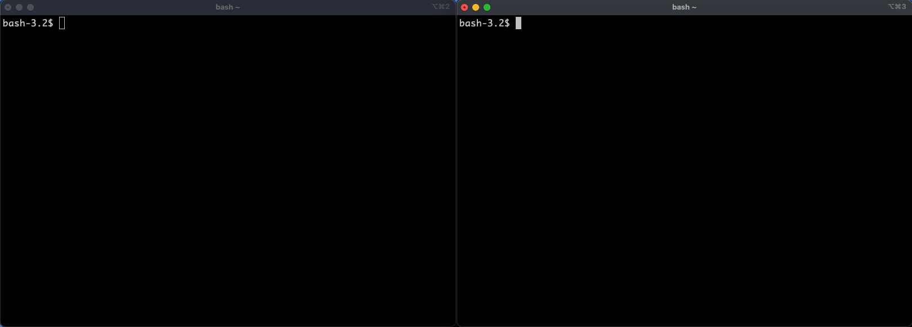

# Cloudflare Worker

Demonstrates how to integrate UpscalerJS in a Cloudflare worker.

## Getting Started

This guide requires running the example locally.

Clone the UpscalerJS repo:

```bash
git clone https://github.com/thekevinscott/UpscalerJS.git
```

And navigate to the cloudflare worker example folder and install the dependencies:

```bash
cd UpscalerJS/examples/cloudflare-worker
npm install
```

Then, in one terminal window, start up the browser frontend with:

```bash
npm run browser:start
```

And in another, the local cloudflare worker backend:

```bash
npm run wrangler:start
```



## Code

A Cloudflare Worker, like a web worker, has a subset of browser functionality. Specifically, it lacks the ability to work with `HTMLImageElement`s or `HTMLCanvasElement`s natively.

What this means for us is that we must deal exclusively with tensors, and serialize them appropriately.

In the browser, we can load an image using `tf`:

```javascript
// browser script
const pixels = tf.browser.fromPixels(img)
```

We can't send a tensor directly in a fetch call, as it cannot be natively serialized to JSON. We instead need to serialize it ourselves. We need to provide the raw data values, along with the shape of the tensor:

```javascript
// browser script
const body = JSON.stringify({
  data: Array.from(await pixels.data()),
  shape: pixels.shape,
})
const response = await fetch(CLOUDFLARE_URL, { //CLOUDFLARE_URL is the URL of the cloudflare worker
  method: 'POST',
  body,
})
```

:::tip

The `@upscalerjs/esrgan-slim` model works well within the free tier of Cloudflare Workers, but for larger models (like `@upscalerjs/esrgan-large`) you'll want to upgrade to a paid plan.

:::

In our Cloudflare Worker, we instantiate UpscalerJS as normal:

```javascript
// cloudflare-worker script
import * as tf from '@tensorflow/tfjs'
import Upscaler from 'upscaler'
import model from '@upscalerjs/esrgan-slim/4x'
const upscaler = new Upscaler({
  model,
})
```

Then we need to unserialize our tensor:

```javascript
// cloudflare-worker script
async function handleRequest(request) {
  const { data, shape } = await request.json()
  const tensor = tf.tensor(data, shape)
  ...
```

We pass this tensor to our UpscalerJS instantiation, _making sure_ to also set the output to `tensor`:

```javascript
// cloudflare-worker script
const upscaledSrc = await upscaler.upscale(input, {
  output: 'tensor',
})
```

We then serialize our tensor again for response:

```javascript
// cloudflare-worker script
const response = {
  data: Array.from(upscaledSrc.dataSync()),
  shape: upscaledSrc.shape,
}
return new Response(JSON.stringify(response), init)
```

And back in the browser, we can unserialize that tensor and work with it:

```javascript
// browser script
const { data, shape } = await response.json()
const tensor = tf.tensor(data, shape)
await tf.browser.toPixels(tensor, canvas)
```
